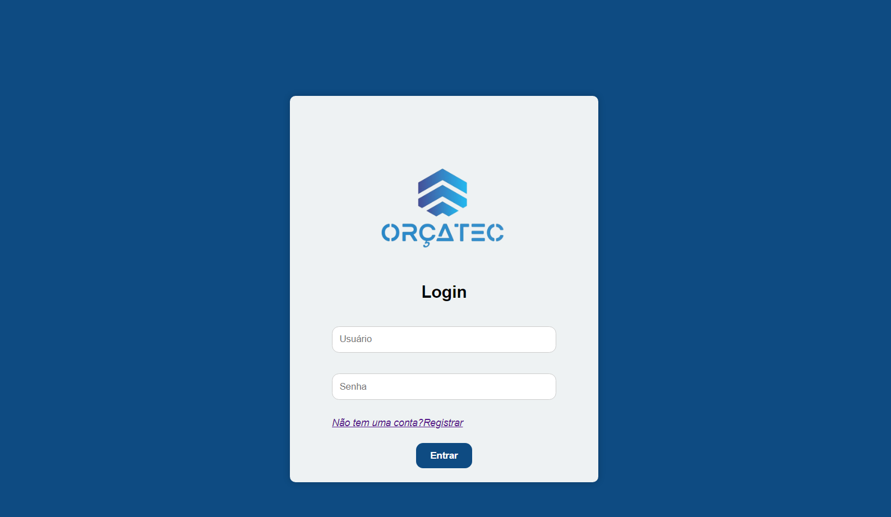
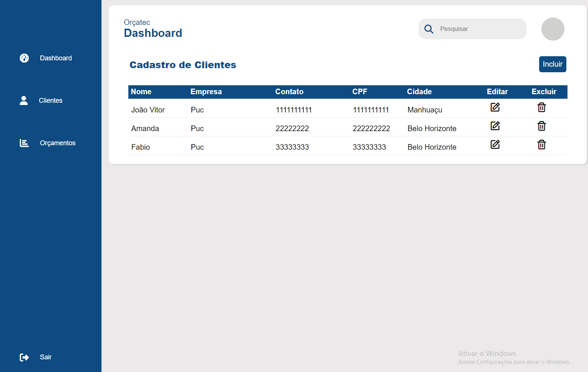
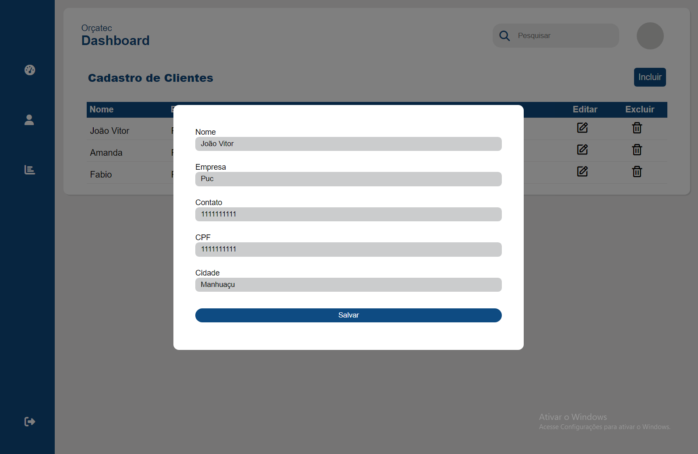
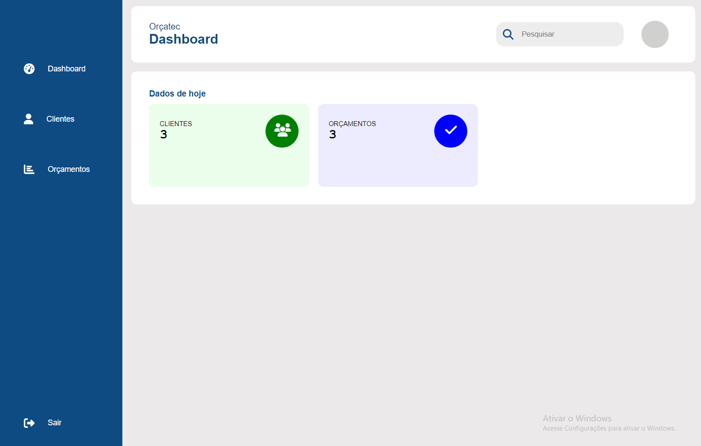

# Programação de Funcionalidades

### Cadastro

#### Requisito atendido

| RF-01 |  Cadastro do cliente na plataforma, para o cadastro deve ser inserido Razão Social, Responsável Legal, CPF/CNPJ, e-mail e telefone, deve ser criada uma senha com no mínimo 8 caracteres| 

#### Artefatos da funcionalidade

codigo-fonte/register.html
codigo-fonte/styles/register.css
codigo-fonte/js/register.js

#### Instruções de Acesso

Acesse a página de Login e clique no botão "Registrar" para fazer o cadastro e ter acesso a plataforma.

#### Responsáveis

Amanda B. Lissa
Joao V. Fochat

### GERADOR DE ORÇAMENTO ORÇATEC

  O Usuario irá preencher os campos de acordo ao Orçamento a ser gerado pelo OrçaTec, seja Receitas, Despesas e Custos com respectivos valores para ser apurado o Valor$ do Orçamento. Após Gerado o Orçamento, na página do OrçaTec é possivel gerar um arquivo pdf para o usuário.

### Elaborado por: 
Fábio  F.C.R

###

### TELA DE CLIENTES RF - (004)

#### Responsávei: João Vitor Vaz Eler Fochat

O acesso a tela de clientes poderá ser feito através do menu do dashboard “CLIENTES”. As estruturas de dados foram baseadas em HTML, CSS e JS.

Exemplo da tela de Cliente:

#### Requisito atendido

RF-004: O site deve permitir ao usuário cadastrar clientes, editar e excluir.

#### Artefatos da funcionalidade

●dashboard.html

●dashboard.css

●client.html

●client.js

●client.css

#### ESTRUTURAS DE DADOS

●client.html

#### INTRUÇOES DE ACESSO

Para acesso, vá ao menu-bar ao lado esquerdo da tela e clique em "Clientes", logo após clique em "incluir" e coloque os dados pedidos, quando feito clica no botao "Salvar". Tambem tem a opcão de editar os dados como mostra na imagem a seguir.

### TELA DO DASHBOARD RF - (005)

#### Responsávei: João Vitor Vaz Eler Fochat

Tela de inicio com os cards de "Clientes" e "Orçamentos". As estruturas de dados foram baseadas em HTML, CSS e JS.

Exemplo da tela Dashboard:

#### Requisito atendido

RF-005: A quantidade de clientes e orçametos gerados, iram ser exibidos nos cads da tela do dashboard.

#### Artefatos da funcionalidade

●dashboard.html

●dashboard.css

#### ESTRUTURAS DE DADOS

●dashboard.html

#### INTRUÇOES DE ACESSO

Todos os clientes incluidos na tabela e orçamentos gerados, iram ser exibidos.

