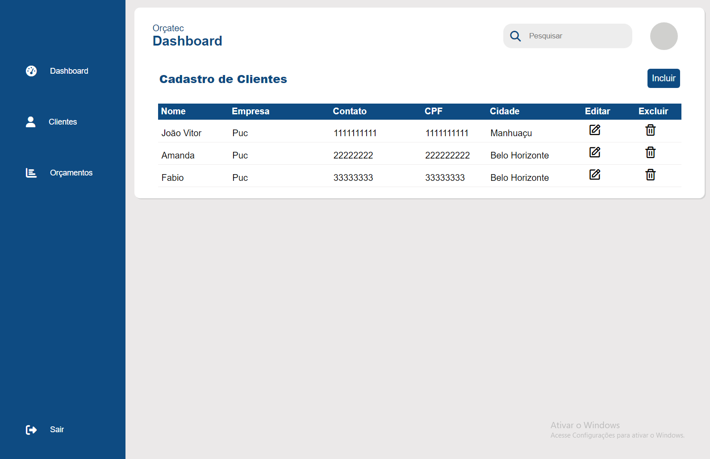

# Programação de Funcionalidades

### Cadastro

#### Requisito atendido

| RF-01 |  Cadastro do cliente na plataforma, para o cadastro deve ser inserido Razão Social, Responsável Legal, CPF/CNPJ, e-mail e telefone, deve ser criada uma senha com no mínimo 8 caracteres| 

#### Artefatos da funcionalidade

codigo-fonte/register.html
codigo-fonte/styles/register.css
codigo-fonte/js/register.js

#### Instruções de Acesso

Acesse a página de Login e clique no botão "Registrar" para fazer o cadastro e ter acesso a plataforma.

#### Responsáveis

Amanda B. Lissa
Joao V. Fochat

### GERADOR DE ORÇAMENTO ORÇATEC

  O Usuario irá preencher os campos de acordo ao Orçamento a ser gerado pelo OrçaTec, seja Receitas, Despesas e Custos com respectivos valores para ser apurado o Valor$ do Orçamento. Após Gerado o Orçamento, na página do OrçaTec é possivel gerar um arquivo pdf para o usuário.

### Elaborado por: 
Fábio  F.C.R

###

###Tela de Orçamento (RF-004)

###Responsável: João Vitor Vaz Eler Fochat

O acesso a tela de orçamento poderá ser feito através do menu do dashboard “Orçamentos”. As estruturas de dados foram baseadas em HTML, CSS e JS.

Exemplo da tela de Orçamento:

###Requisito atendido
RF-004: O site deve permitir ao usuário gerar um orçamento.

###Artefatos da funcionalidade

●dashboard.html

●dashboard.css

●criar-orcamento.html

●orcamento.js

●common.js

###Estrutura de Dados

●criar-orcamento.html

###Instruções de acesso

Para acesso, vá ao menu-bar ao lado esquerdo da tela e clique em "Orçamentos", logo após clique em "Fazer Orçamento" e coloque os dados pedidos, quando feito clica no botao "Gerar Orçamento" e depois em "ok" (vai aparecer uma mensagem na tela). Logo em seguida na pagina pricipal do dashboard vai aparecer o pedido gerado.

